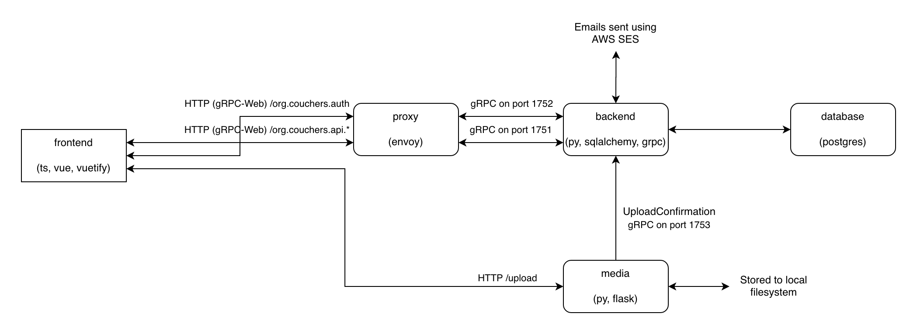

# Architecture Overview

## High-level components

There's a backend written in Python (in `//app/backend/`), and a frontend written in TypeScript with Vue.js and Vuetify.js for widgets (in `//app/frontend/`).

The frontend is a static app that we deploy on a CDN (AWS CloudFront through an S3 bucket). The frontend talks to the backend through gRPC, a Remote Procedure Call library that uses Protocol Buffers, or protobufs (in `//app/pb`/). Because of a small incompatibility between the HTTP2-based protocol used in gRPC and the common-place HTTP used on the web, there needs to be a proxy translating the two when using these in the browser. For that there's Envoy proxy (in `//app/proxy/`).

User media is uploaded to the media server (in `//app/media`). It's built into a different container and potentially runs on a different machine. The purpose is to isolate user content (which can potentially be arbitrary user content) from the main server. It's also served off a different domain for cookie protection reasons.

Everything's built into docker containers and can be spun up together with `docker-compose`. This gives us an easy way to deploy the app, as well as some isolation and reproducibility afforded by containerisation.
